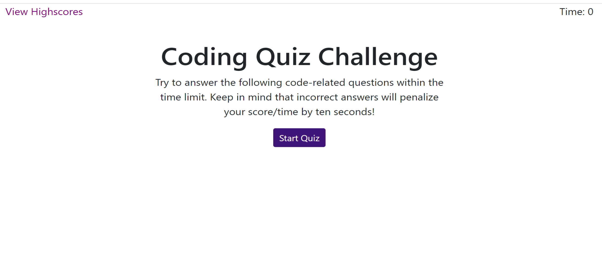

# Code-Quiz

## The Repository

The link to the website repository: [Website Repo link](https://github.com/NavdeepDP/Code-Quiz)

The site is published at [Published Website link](https://navdeepdp.github.io/Code-Quiz/)

## Development Environment
Code is developed in VS code Studio

## Website Functionality

 - Code Quiz website offers online quiz system. Start page is as follows
 

- To start the quiz press the "Start Quiz" button.
- Timer will start and the user will see the first question.
- User can select the suitable answer by clicking the options. Right after the selection, the selected option will be evaluated.
-" Correct" or "Wrong" will be displayed to let the user know if the answer is correct or not.
- For each wrong answer 15 secs are reduced from the time assigned for the quiz.
- If the time assigned for the test is over or if all the questions are answered following will be displayed with the
  displaying the total score (5 points for every correct answer).

  

- User can enter initials and submit. After submission user can see the list of all the high scores.

  

- "Clear Highscores" will clear all the highscores stored.

- Press "Go Back" to quiz start page.

## Installation

- Code is developed using VS Code studio.
- Code is available at the GITHub repository link: [Website Repo link](https://github.com/NavdeepDP/Code-Quiz)
- Get the code code in your local machine by using the clone option in the repository link.
- Click "Code" and copy the Clone with SSH key link.
- In Git bash, go to the appropriate directory and get the code using "git clone" command.
- Open index.html. Right click and open in browser of your choice to view the website.

## References

- [w3schools.com](https://www.w3schools.com/)
- [MDN web docs](https://developer.mozilla.org/en-US/docs/Web/JavaScript)

